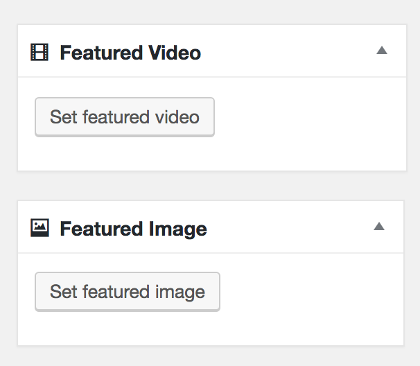
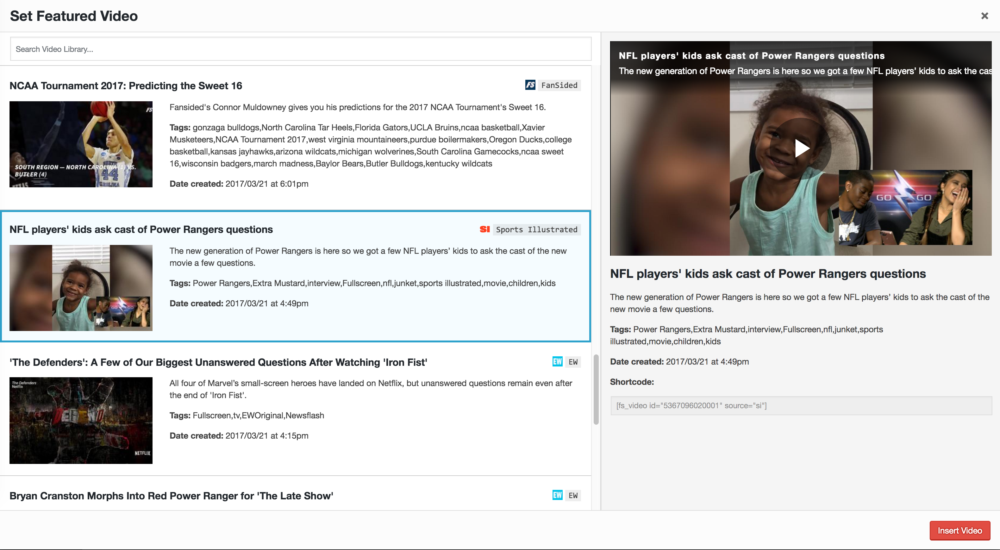
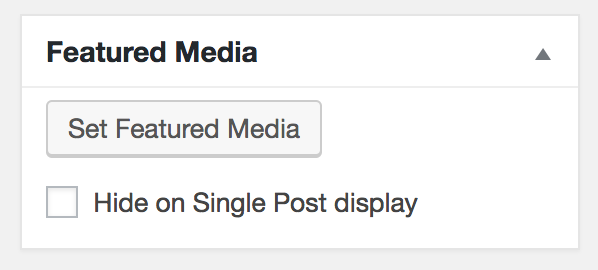
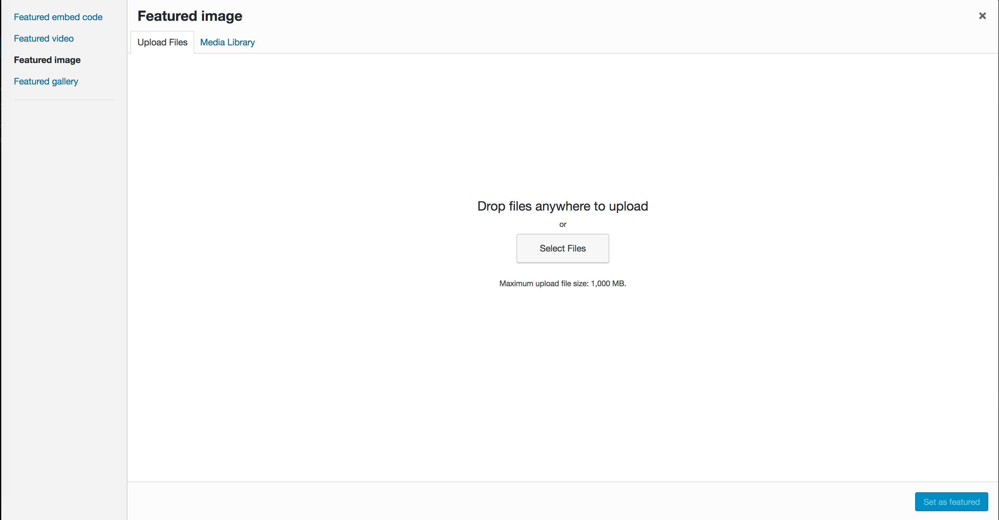
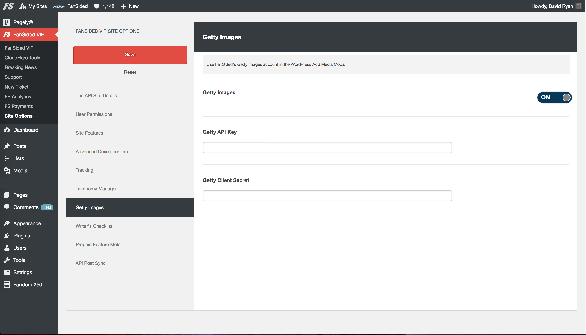

## Building Intuitive 
### WordPress Admin Experiences

David Ryan | daveryan.io | Web Developer @ FanSided
---
## CREATE EXPERIENCES
## DEFINE INTUITIVE
## LETS BUILD!
---
> “You can design and create, 
and build the most wonderful place in the world… 
But it takes people to make the dream a reality.”

#### - Walt Disney -
---
### Human-Centered Design
#### 1. Inspiration
*Qualitative & quantitative research.*

#### 2. Ideation <!-- .element: class="fragment" -->
*Exploratory brainstorm.* <!-- .element: class="fragment" -->

#### 3. Implementation <!-- .element: class="fragment" -->
*Conscious creation.* <!-- .element: class="fragment" -->
+++


#### [IDEO Design Kit](http://designkit.org);

---
### Incomplete Intuitive Litmus Test
* People-first, woke development.
* Leverage visual toolbox. Assign hiearchy. Tidy. Tuck. <!-- .element: class="fragment" -->
* Flows that scale. <!-- .element: class="fragment" -->
* Parallel constructs & pairing language. <!-- .element: class="fragment" -->
* Respect established norms, design language. <!-- .element: class="fragment" -->
---
### Buildin'
1. Techniques for success
2. Common trouble areas
3. Case Study: Featured Video / Media
4. More deets
---
### Techniques For Success
Have exceptional / informed reasons for Core deviation. But don't torture Core or your product.

* Test with all plugins/themes on. <!-- .element: class="fragment" -->
* Iterate quickly, fail cheaply. <!-- .element: class="fragment" -->
* Be elastic, build growing room. <!-- .element: class="fragment" -->
* Be mindful of "cognitave enqueues." <!-- .element: class="fragment" -->
---
### Common Trouble Areas
* Confusing / conflicting color schemes.
* Misappropriating Dashicons or rolling jarring custom. <!-- .element: class="fragment" -->
* Wordy interfaces. Thin interfaces. <!-- .element: class="fragment" -->
* Dense / unpruned interfaces. <!-- .element: class="fragment" -->
---
### Case Study: Featured Video / Media
##### FanSided Video Library
###### Add metabox mirroring Featured Image in UI and flow.
 <!-- .element: class="fragment" -->
---
### Case Study: Featured Video / Media
##### FanSided Video Library
###### Add metabox mirroring Featured Image in UI and flow.

---
### Case Study: Featured Video / Media
##### Institute for Nonprofit News: Largo
###### Used to remove and put "Set Featured Media" next to "Add Media."
###### Now uses metabox.
  <!-- .element: class="fragment" -->
+++
##### Open Discussion About Change:
https://github.com/INN/Largo/pull/1285

##### Project Largo
https://largo.inn.org/

---
### Case Study: Featured Video / Media
##### Institute for Nonprofit News: Largo
###### Used to remove and put "Set Featured Media" next to "Add Media."
###### Now uses metabox.

+++
https://github.com/INN/Largo/blob/master/js/featured-media.js
https://github.com/INN/Largo/blob/master/inc/featured-media.php
---
### Resources in wp-admin
* Non-abstracted Components & CSS - Buttons, List Tables, Tabs, Filter Bar, Notifications, Cards, Grids, etc.
* Data APIs - Options, Meta, Transient, Heartbeat, Filesystem, REST, XML-RPC <!-- .element: class="fragment" -->
* "Component APIs" <!-- .element: class="fragment" -->
    * Customizer <!-- .element: class="fragment" -->
    * Dashboard Widgets API <!-- .element: class="fragment" -->
    * Metabox API <!-- .element: class="fragment" -->
    * The WordPress Media Modal (wp.media) / wp.template <!-- .element: class="fragment" -->
---
### My tips and nitpicks
* Design flows on paper.
* Avoid complex grids greater than 3-5 across.
* Left-aligned vertical menus shouldn't be dark-themed.

---
### My tips and nitpicks
* Select2 / Selectize / Chosen -- test pls & add disable filter!
* For the love of blog, please test your JavaScript.
---
### Friends to invite to wp-admin party
* Yahoo's Pure CSS written to play nice with other frameworks, decent drop-in.
* localforage.js is great.
* jQuery + Underscores is a _dirt-cheap_ way to feel more 'React-y.' Just sayin'. 
+++
##### Yahoo Pure CSS
https://purecss.io/
##### Mozilla's Localforage graceful browser storage
http://localforage.github.io/localForage/
##### Justin Tadlock's _rad_ intro
http://themehybrid.com/weblog/intro-to-underscore-js-templates-in-wordpress
---
### wp.template + jQuery + your JSON data from somewhere
```
<div class="container"></div>
<script id="tmpl-local-greeting" type="text/html">
   <div class="welcome">
      Welcome to {{ data.city }}!
      <span class="{{ data.emoji }}"></span>
   </div>
</script>

<script type="text/javascript">
   var welcomeTemplate = wp.template( 'local-greeting' );
   var theContainer = jQuery( '.container' );
   var theData = {"city":"San Diego","emoji":"dancingsealion"};
   // punch it chewie!
   theContainer.html( welcomeTemplate( theData ) );
</script>
```
---
# The End.
